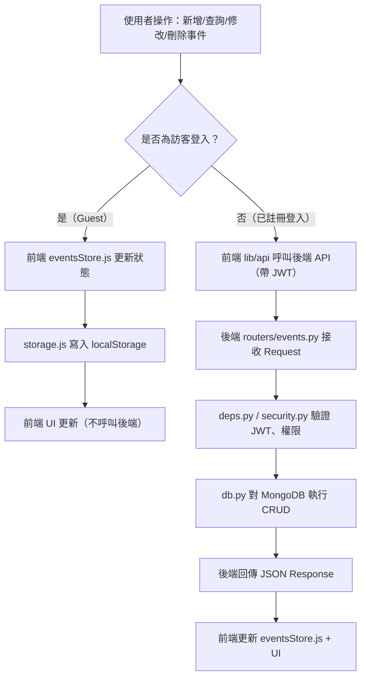
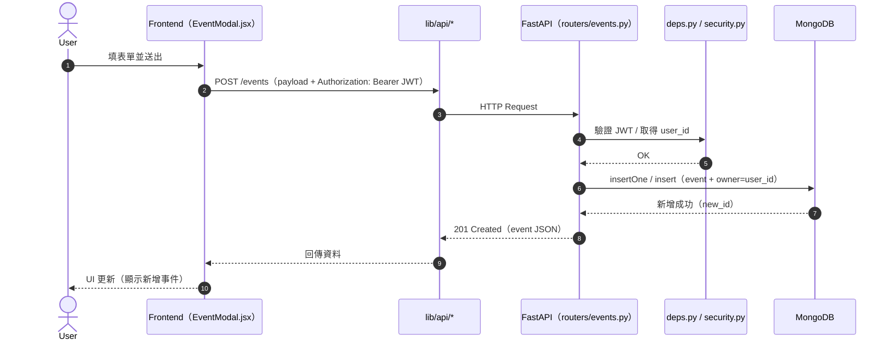
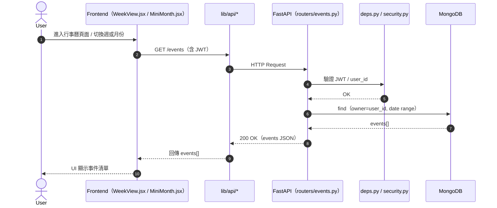
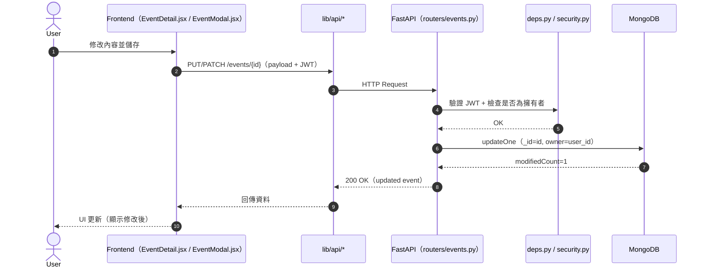
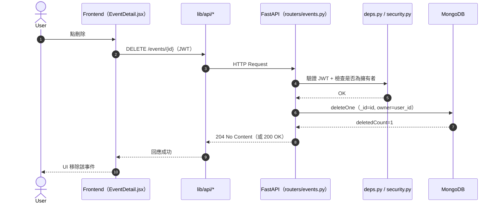
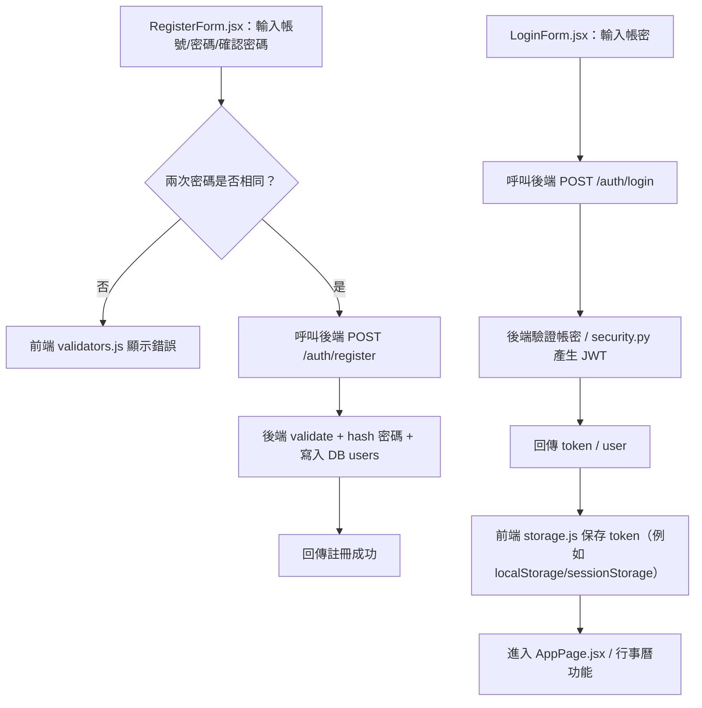

# WEB_FINAL（114tku_web_final）前後端架構圖與 CRUD 流程圖

> 本文件依照你目前的專案結構（Frontend: React/Vite；Backend: FastAPI；DB: MongoDB / Docker Compose）整理。  
> 圖表使用 **Mermaid**，在 GitHub / VS Code（裝 Mermaid 外掛）即可直接顯示。

---

## 1) 系統架構圖（Frontend + Backend + Database）

```mermaid
flowchart LR
  %% ======= Frontend =======
  subgraph FE[Frontend（Vite + React）]
    FE_pages[pages/\n- AuthPage.jsx\n- AppPage.jsx]
    FE_auth[components/auth/\n- AuthCard.jsx\n- LoginForm.jsx\n- RegisterForm.jsx\n- ForgotPasswordModal.jsx]
    FE_cal[components/calendar/\n- WeekView.jsx\n- MiniMonth.jsx\n- EventModal.jsx\n- EventDetail.jsx]
    FE_lib[lib/\n- api/*\n- eventsStore.js\n- storage.js\n- validators.js\n- dateUtils.js]

    FE_pages --> FE_auth
    FE_pages --> FE_cal
    FE_auth --> FE_lib
    FE_cal --> FE_lib
  end

  %% ======= Backend =======
  subgraph BE[Backend（FastAPI）]
    BE_main[main.py\nFastAPI app / include_router]
    BE_routers[routers/\n- auth.py\n- events.py]
    BE_models[models/\n- user.py\n- event.py]
    BE_deps[deps.py\nAuth deps / roles]
    BE_sec[security.py\nJWT / password hash / token verify]
    BE_db[db.py\nDB client / collections]
    BE_cfg[config.py\n讀取 .env / settings]

    BE_main --> BE_routers
    BE_routers --> BE_models
    BE_routers --> BE_deps
    BE_deps --> BE_sec
    BE_routers --> BE_db
    BE_db --> BE_cfg
  end

  %% ======= Database =======
  subgraph DB[Database]
    MDB[(MongoDB)]
  end

  %% ======= External =======
  User((使用者))
  Browser[Browser]

  User --> Browser --> FE
  FE_lib -- HTTP/JSON --> BE_main
  BE_db -- CRUD --> MDB

  %% ======= Guest Mode =======
  FE_lib -. 訪客模式：只用 localStorage（storage.js / eventsStore.js） .-> Local[(Browser localStorage)]
```

---

## 2) CRUD 流程圖（事件 Event：Create / Read / Update / Delete）

### 2.1 登入狀態與訪客模式總流程（分流）



---

### 2.2 CRUD 詳細（已登入：前端 → 後端 → DB → 前端）

> 你可以把下列 API 路徑視為範例（實際以 `routers/events.py` 定義為準）。  
> - Create: `POST /events`  
> - Read: `GET /events`、`GET /events/{id}`  
> - Update: `PUT /events/{id}` 或 `PATCH /events/{id}`  
> - Delete: `DELETE /events/{id}`  

#### (A) Create（新增事件）



#### (B) Read（讀取事件清單 / 單筆）



#### (C) Update（修改事件）



#### (D) Delete（刪除事件）



---

## 3) 補充：Auth（註冊 / 登入）簡化流程（可放在報告）



---

### 你可以怎麼用這份檔案
- 放到專案根目錄：`114tku_web_final/ARCHITECTURE_AND_FLOW.md`
- 或直接貼到 README 的「系統架構」與「流程圖」章節
